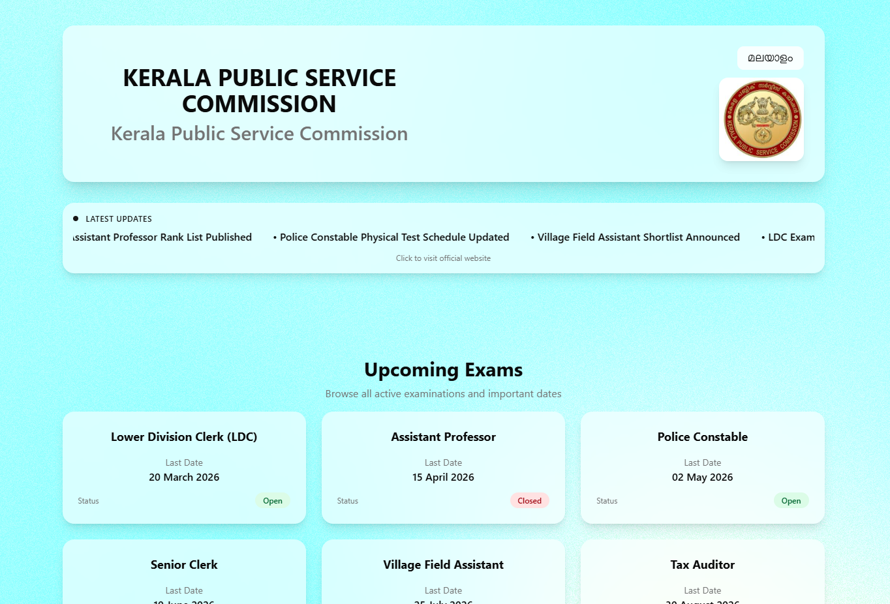
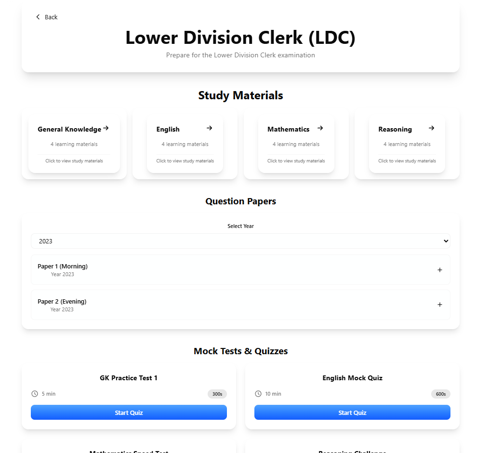
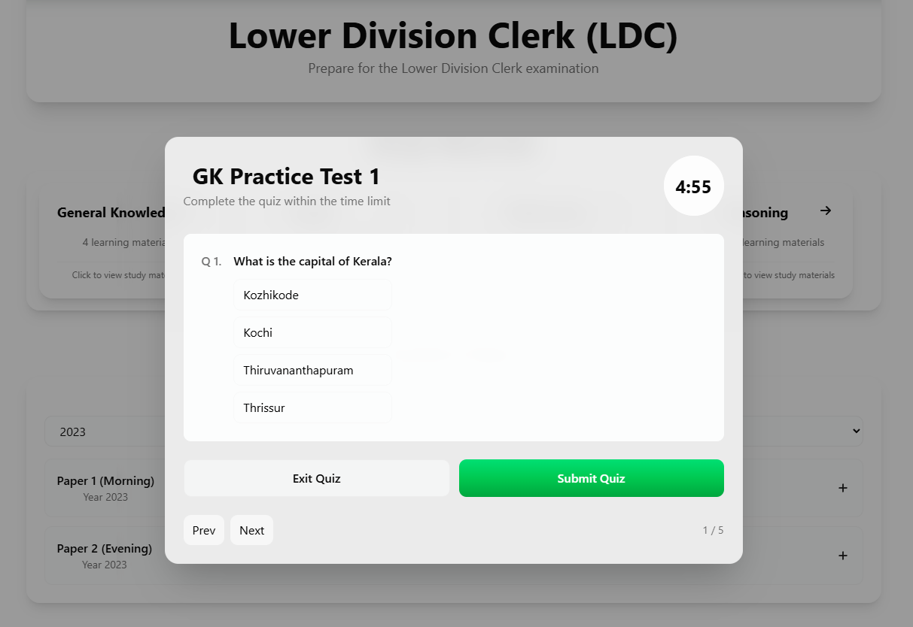

<p align="center">
  
</p>

# AcePSC 🎯

## Basic Details

### Team Name: EOF

### Team Members

- Member 1: Anna Grace - RIT, Kottayam

### Hosted Project Link

https://psc-init-self-u5nw.vercel.app/

### Project Description

AcePSC is a comprehensive learning platform for PSC candidates that integrates study materials, interactive quizzes, Pomodoro-based focused study sessions, spaced repetition, and progress tracking. The platform supports students, mentors, and admins with role-based management and structured learning paths across various exam levels, subjects, and topics.

### The Problem statement

Many PSC candidates struggle with long-term retention due to rote memorization and the absence of scientifically proven techniques like spaced repetition and active recall. Existing coaching systems focus only on content delivery, continuous assessment, and progress tracking, but students are left unaware of their strong and weak areas. Lack of time management support and focused study practices often leads to burnout and inconsistent preparation, especially for working aspirants. These limitations make it difficult for PSC candidates to maintain sustained motivation, retain concepts effectively, and be fully exam-ready.

### The Solution

This platform provides a comprehensive educational ecosystem for Students, Mentors, and Admins by integrating role-based management with structured learning paths. Students can access study materials, engage in Pomodoro-focused study sessions, and raise queries for mentors. Assessment is a core component, allowing users to attempt revision quizzes and mock exams while the platform automatically tracks performance metrics such as accuracy, time taken, progress history, and strong/weak areas. Administrators oversee the platform by managing accounts, notice board, and materials, while a built-in rating system for materials ensures quality control. By logging every interaction—from quiz attempts to mentor verifications—the platform maintains a detailed activity history that allows mentors to monitor performance and students to achieve their learning goals through a data-driven, supported environment.

---

## Technical Details

### Technologies/Components Used

**For Software:**

- Languages used: JavaScript, TypeScript
- Frameworks used: React, Vite
- Libraries used: React Router, Tailwind CSS
- Tools used: VS Code, Git, Vercel

---

## Features

List the key features of your project:

- Role-based access for Students, Mentors, and Admins
- Exam dashboard with bilingual support and exam-level filtering
- Study materials and revision quizzes for each subject
- Interactive quizzes with timer, instant scoring, and answer review
- Pomodoro-based focused study session
- Progress tracking and analytics
- Admin panel for managing users, materials, and notices

---

## Implementation

### For Software:

#### Installation

```bash
[Installation commands - e.g., npm install, pip install -r requirements.txt]
```

#### Run

```bash
[Run commands - e.g., npm start, python app.py]
```

### For Software:

#### Screenshots (Add at least 3)


_dashboard showing exams and notifications_


_separate page for each exam showing materials, quizes_


_quiz based on selected subject_

#### Diagrams

**System Architecture:**


_Explain your system architecture - components, data flow, tech stack interaction_

**Application Workflow:**


_Add caption explaining your workflow_

---

## Project Demo

### Video

https://www.awesomescreenshot.com/video/49437635?key=462cf9dc2421583e857c3f711ba2f0a7

_Explain what the video demonstrates - key features, user flow, technical highlights_

### Additional Demos

[Add any extra demo materials/links - Live site, APK download, online demo, etc.]

---

## AI Tools Used (Optional - For Transparency Bonus)

If you used AI tools during development, document them here for transparency:

**Tool Used:** [e.g., GitHub Copilot, v0.dev, Cursor, ChatGPT, Claude]

**Purpose:** [What you used it for]

- Example: "Generated boilerplate React components"
- Example: "Debugging assistance for async functions"
- Example: "Code review and optimization suggestions"

**Key Prompts Used:**

- "Create a REST API endpoint for user authentication"
- "Debug this async function that's causing race conditions"
- "Optimize this database query for better performance"

**Percentage of AI-generated code:** [Approximately X%]

**Human Contributions:**

- Architecture design and planning
- Custom business logic implementation
- Integration and testing
- UI/UX design decisions

_Note: Proper documentation of AI usage demonstrates transparency and earns bonus points in evaluation!_

---

## License

This project is licensed under the [LICENSE_NAME] License - see the [LICENSE](LICENSE) file for details.

**Common License Options:**

- MIT License (Permissive, widely used)
- Apache 2.0 (Permissive with patent grant)
- GPL v3 (Copyleft, requires derivative works to be open source)

---

Made with ❤️ at TinkerHub
